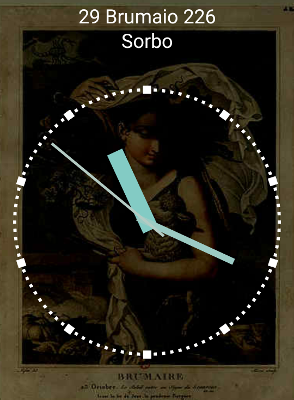

# Decimal DateTime for Android and iOS

Analogic watch for Android and iOS, based on Xamarin Forms, which shows instead of the normal 12 hours/60 minutes a "revolutionary" decimal time.

## In memory of Alessandro Candelari, aka Pallettaro

This project was originally developed by Alessandro Candelari, a friend of mine who passed away in June 2017. For a while we helped him with some other friends, but as often happened with Ale, after some weeks of working he abandoned everything because he lost interest in it...
I truly believe that it's a pity to waste a so brilliant idea and quite good job, so I decided to keep the project alive.

## Decimal time

Decimal time was introduced in France a few years after the revolution of 1789, and for a while it replaced the normal way of measuring the time. With decimal time a day is divided in ten hours, each one made by 100 minutes and a minute is divided in 100 seconds. So a second is a bit faster because in a day there are 100000 seconds (10 x 100 x 100) instead of 86400 (24 x 60 x 60).

[More info about decimal time](https://en.wikipedia.org/wiki/Decimal_time).

## French republican calendar

To be fully revolutionary this watch converts also the current date in the French republican calendar, a calendar intruduced in France after the revolution. With this calendar every month is 30 days long, and every week 10 days long. In a year there are still 12 months, but there is also a much shorter 13th month used to "complete" the year.

[More info about republican calendar](https://en.wikipedia.org/wiki/French_Republican_Calendar).

## NuGet library

All the logic behing the clock is a library you can download from [NuGet](https://www.nuget.org/packages/Decimal.DateTime/).

More info here: [https://github.com/nonno/decimal-datetime](https://github.com/nonno/decimal-datetime).